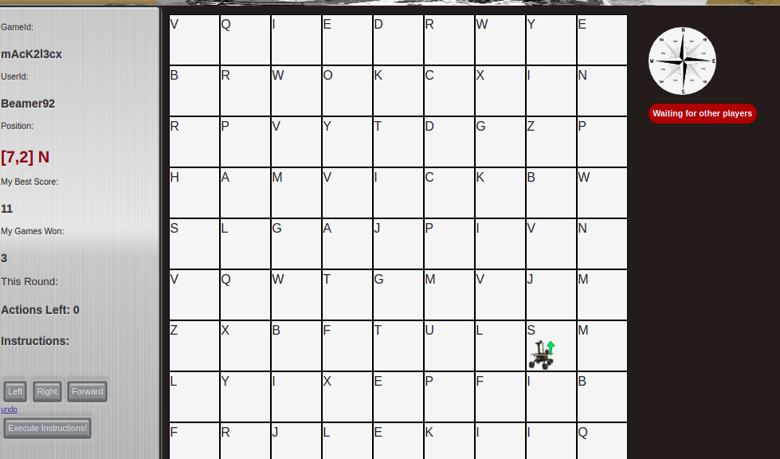

# Rabble Rover FE

This is the Front End for the Galvanize Capstone Project Game - Rabble Rover

This game uses React, socket.io, MongoDB, and Redis to interact with the game-state.

In the game you play as a Mars Rover, going around the surface of Mars collecting Letters to build
the best Scrabble Word before other players.

You interact with your Rover by issuing up to 5 commands per turn such as Left, Right and Forward.
These instructions are translated into instructions that move your Rover across the board, collecting letters before your opponents. Once a letter is picked up, it's gone for good.

Strategic players will also steal letters and drop them to keep others from getting them!

## Login

## The Rover

## The Game

## Run in Development

### `npm start`

Runs the app in the development mode. 
Open [http://localhost:3000](http://localhost:3000) to view it in the browser.

The page will reload if you make edits. 
You will also see any lint errors in the console.

## To-Do/Future-Improvements:
- Give score bonuses for finishing first, second, third, forth etc
- Put 30 second TimeOut on Turns
